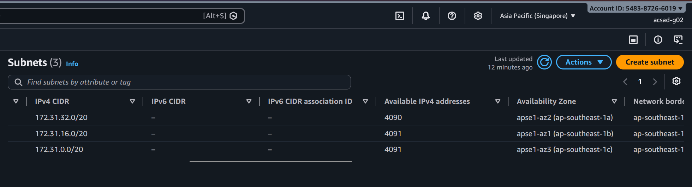
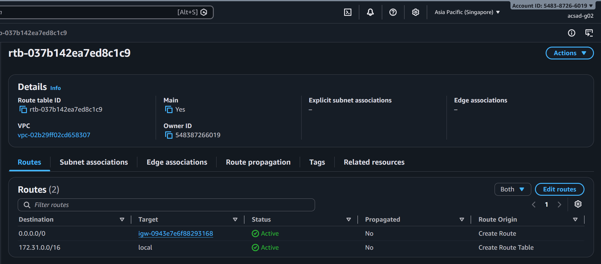
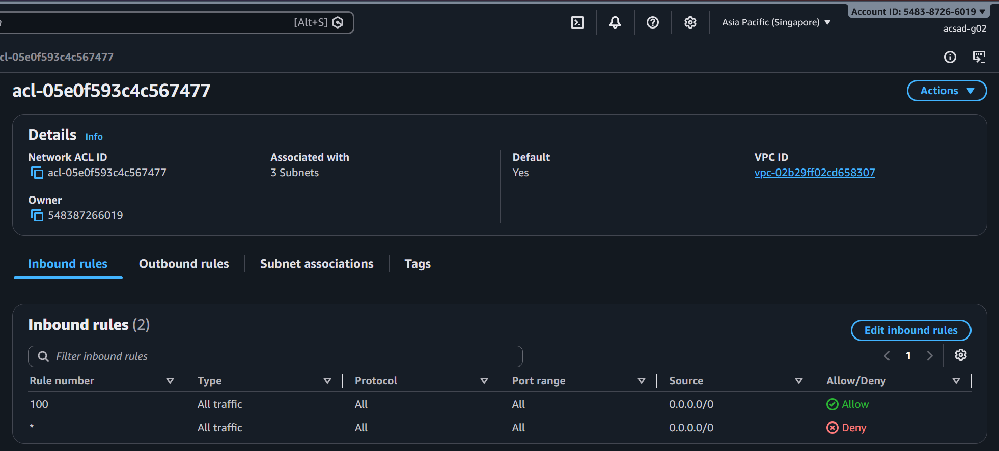
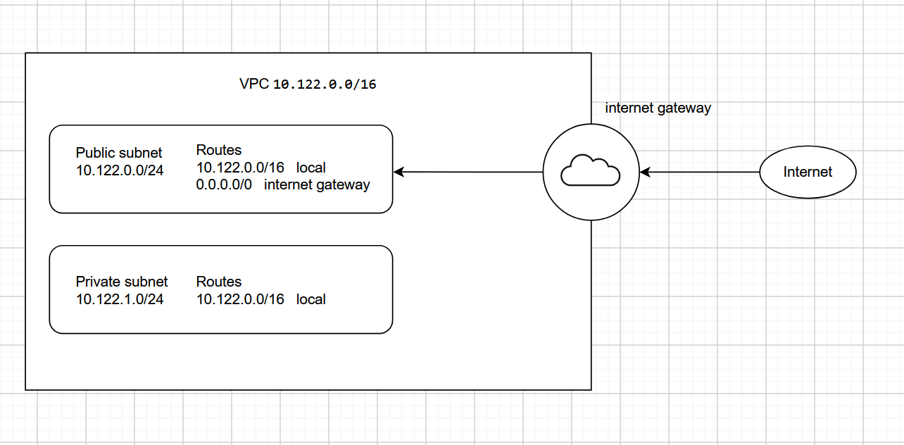

# Assignment 2 Submission

<!--
How to use this template:

1. Copy this file to submissions/assignment-2/<your-github-username>/submission.md
2. Replace every answer placeholder with your own answer. Delete the angle brackets too.
3. Save your four images in the same folder, with the exact file names below.
4. Do not write your full name or your student number in this file.
-->

## About me

- GitHub username: shinu-syr
- Section: IV-ACSAD
- IAM user name that I signed in with: acsad-g02
- X: 122

---

## Part A. Explore

### A1. The VPC

Default VPC IPv4 CIDR:

172.31.0.0/16 

Number of addresses in that CIDR:

65,536

### A2. The subnets

| Availability Zone | IPv4 CIDR |
| --- | --- |
| apse1-az2 (ap-southeast-1a) | 172.31.32.0/20 |
| apse1-az1 (ap-southeast-1b) | 172.31.16.0/20 |
| apse1-az3 (ap-southeast-1c) | 172.31.0.0/20 |

Screenshot 1. Save it as `screenshot-1-subnets.png` in your folder. The image line below shows it.

### A3. Available addresses

Available IPv4 addresses in each subnet:

apse1-az2 (ap-southeast-1a) 4,090, apse1-az1 (ap-southeast-1b) 4,091, apse1-az3 (ap-southeast-1c) 4,091.

Why is the number lower than 4,096?

the number is lower than 4,096 because AWS reserves/utilizes the 5 IPv4 addresses by default per subnet for networking purposes.

What uses the missing address in the subnet with the lowest number?

the lowest subnet nuumber is the apse1-az2 (ap-southeast-1a) 4,090, it is lower because additional IPv4 is being used by my EC2 instance

### A4. The route table

| Destination | Target |
| --- | --- |
| 0.0.0.0/0 | igw-0943e7e6f88293168 |
| 172.31.0.0/16 | local |

Screenshot 2. Save it as `screenshot-2-routes.png` in your folder. The image line below shows it.

### A5. Public or private

Are the default subnets public or private? Which route proves it?

the default subnets are public, because the 0.0.0.0/0 igw-0943e7e6f88293168 routes internet bound traffic in the internet gatetway

### A6. The internet gateway

State of the internet gateway:

Attached

What happens to the default subnets if the gateway is detached?

the default subnet would lose internet, hence the 0.0.0.0/0 to igw-0943e7e6f88293168 would not work. But communication within the same VPC would still function

### A7. NAT gateways

Number of NAT gateways:

0 (none)

Can a server in a new private subnet download updates? Why?

no, because there are no NAT gateways configured to provide internet access to resources in the private subnet

### A8. The network ACL

| Rule number | Source | Allow or Deny |
| --- | --- | --- |
| 100 | 0.0.0.0/0 | Allow |
| * | 0.0.0.0/0 | Deny |

How is a network ACL different from a security group?

network ACL controls the traffic at a subnet level and stateless, so inbound and outbound must be allowed separately, while securtiy group controls traffic at a instance level and is stateful, so return traffic is automatically allowed.

Screenshot 3. Save it as `screenshot-3-network-acl.png` in your folder. The image line below shows it.

### A9. The default security group

Inbound rule (type and source):

All traffic, from sg-0c5b6d4081cf0a534 the the default security group itself

Which resources can send traffic to an instance that uses it?

from the resources associated with the same security group

---

## Part B. Prepare

### B1. Plan two subnets

- Public subnet CIDR: 10.122.0.0/24
- Private subnet CIDR: 10.122.1.0/24

### B2. Route tables

Route table of the public subnet:

| Destination | Target |
| --- | --- |
| 10.122.0.0/16 | local |
| 0.0.0.0/0 | internet gateway |

Route table of the private subnet:

| Destination | Target |
| --- | --- |
| 10.122.0.0/16 | local |

### B3. My VPC diagram

Tool used (Excalidraw, draw.io, Lucidchart, or paper):

draw.io

Save your diagram as `vpc-diagram.png` in your folder. The image line below shows it.

### B4. Predict a change

Can you still open the web page from your laptop? Why?

no, because 0.0.0.0/0 route to the internet gateway has been deleted, so the instance would no longer have a route to the internet

Can the instance still reach another instance in the VPC? Why?

yes, because the 172.31.0.0/16 local route allows communication within the VPC

### B5. Place a database

Which subnet gets the database? Why?

the database should be placed inside the private subnet so that it wouldnt be accessible from the internet, not only does it improve security, but reduce exposure to external traffic

### B6. My question about VPCs

What is your question, and what made you think of it?

if something is placed within a private subnet, like the database, and i dont give it a NAT gateway, are there any other way to let it communicate with the AWS services