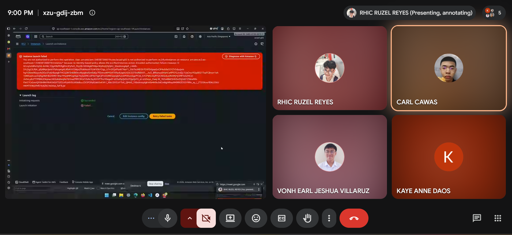
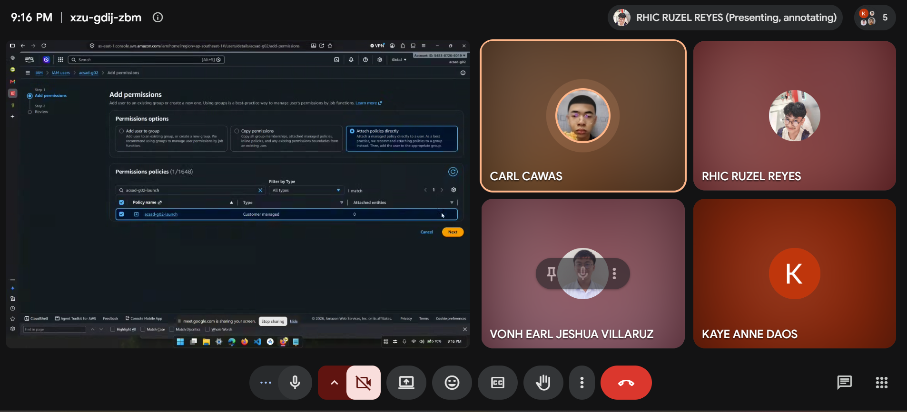
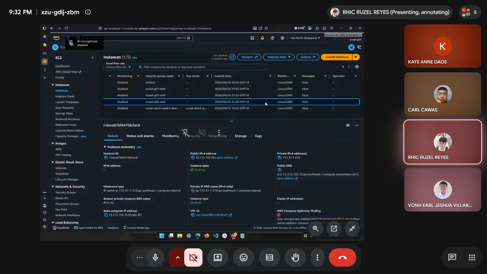
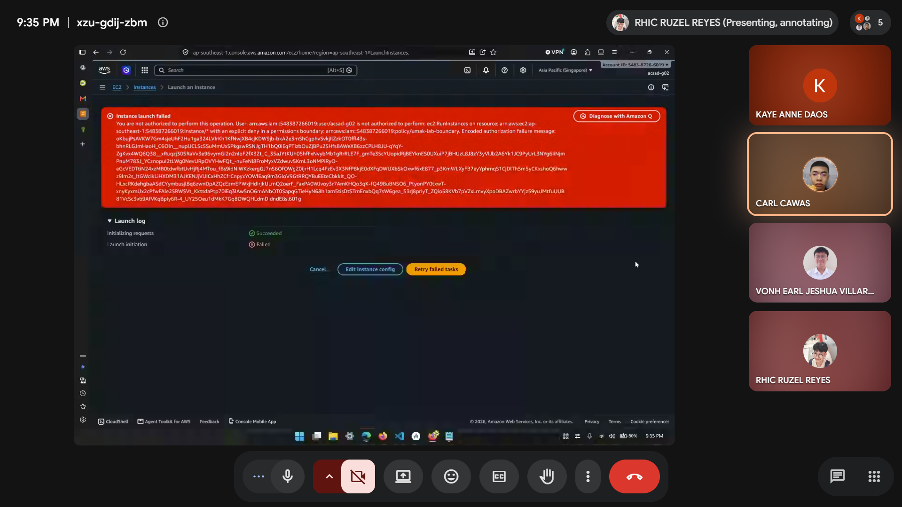
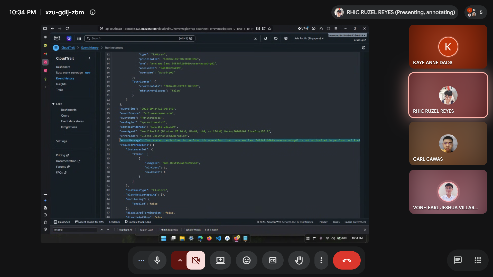

# Lab 1 Submission

## Part B
**Error Action Name:** <paste error text and bold the action>

**Screenshot (Part B launch denial with username visible):**

## Part C
**Policy Statement Blanks:**
- `"Action"`: "ec2:RunInstances"
- `"Resource"`: "arn:aws:ec2:ap-southeast-1:548387266019:instance/*"
- `"ec2:InstanceType"`: "t3.micro"

## Part D
**Security Group Error Text:** "You are not authorized to perform this operation. User: arn:aws:iam::548387266019:user/acsad-g02 is not authorized to perform: ec2:CreateSecurityGroup on resource: arn:aws:ec2:ap-southeast-1:548387266019:security-group/* because no identity-based policy allows the ec2:CreateSecurityGroup action. Encoded authorization failure message: ROmxJcqGkqBvQFtM6GZLNEngrMuBWv9AfprHAsqoiLj9Tq-bi6Ip2RZsINAz7hwkJajEMzMHZS48c2eCXiAzVYViqEKuERuBtFfMxxeerx1afDbmog4eOMfk-h8a330OduHehFxQl0k1mRmfMsgpgda9dCiRvG9cLRocUU-CovgQ3BFnCrBiU5mzvJ3zi8zSkI15NX64O0i9-z45ljzCSvsViJIWapwYc0iZXja1SbQzWdTdFBJ_jQ24hk86YacpDhGu_xxK6AYNNK5K9SHtS_jMX4YP4d8DS97apZU0jwg2k_W-Nhgm2XwrJ2a1KjpzBNb9zq2LVNjGCaIhtVxjEqhm5xayXYI48a-oISWcWUDPJKqOT0LdTUUFka0f9zykq5Ide6H-UaPgy3p41tTSbeXI2DL7MxBU6M-HEnd_MqiMr8nvasaNeS5fbx7pi0hIpPvXS485T76UDUslcvTZWzuA4JXm5vMnS6QGOaRXpWtvOge7zg7yG1ykoxzxh21uJBL-mbeoyp1hFT1nnMC4D5zoOxfbH1lLRZlka7I9
"

**Running Instance Time:** "2026/09/24 21:29 GMT+8"

**Screenshot 1 (Permissions tab listing <user>-launch):**

**Screenshot 2 (Instance in Running state):**

## Part E
**t3.small / Tokyo Denial Error:** "Instance launch failed
You are not authorized to perform this operation. User: arn:aws:iam::548387266019:user/acsad-g02 is not authorized to perform: ec2:RunInstances on resource: arn:aws:ec2:ap-southeast-1:548387266019:instance/* with an explicit deny in a permissions boundary: arn:aws:iam::548387266019:policy/umak-lab-boundary. Encoded authorization failure message: v-ipeCWLlg8WC9SkVKK3RQclwds8qawZEXgotCk5zWL6r9kCPpBhkFzCDWKKwmRuKj8vSAGU-0-Kbyrjhx6Kj7yagcGPz7ZYQx4NpxVZEjNaPu4q4vpUUTNy7vdXU5ZEsd1zSPVvnm-oLSXuTkD9xlHqJ15eSf1hcGgn6mw-iUgc5h0DEHwGKBqHIS3k0dvUHgWRToAJIUN_RP49u6Q-jSrfTIli8HKkeRJ7Pfz_SNEZyzJpYABAx8vL9YiL3Ri_TXWUS3S-4pAHkkFsn_lwioDH65ccDLXHJGB-ztjQJgJBKDUAAEFJAmm3WkGnFD1pg-9GqAdRUxsm8PkJ31qYW0tJy0Key4KY2PWFvzcL0bZirYAOwdZN8EDMEs21p2XdC4dTeIQGgh_mR1gXkhe9NgcnNrhtH87ZnQGq7CP3jk9axmIP7-6LdLiEhbEeVyFL88cHC4Q4lf1cfwz5PDkG8DdCDtJ-FS02a6SyagdhVF7AX_SbkHIeAjecrfiMNy9rLHthnwVWdu3azOxC-lYOUnPoFRYpkAzg2ZaDjJ9W32vnFroZqU_Ng4rFhg7us131zudHJGcRijeTiGnWa7rSNFz3QUTEZGrJRUw0nsRKn9O074qZIt_TqN1enN7mniKI-RXjf8S0VU32miS0HiiBimlB3Myy57PXPcZw98CfWu3D7S8rMcqr0Piq7VXuO3h_GsjTRDh-JUPxVGgBfAeuIbs7O6tAvsfFJ_ItA_Gy51O13qLtRR2wc5NcEfA3CiI4aFMc-7v0C9Gt5NYvEIxOlr4Nymyrs925eGQkWGIGM6SvkF7hbYkdRHol3f6a_vpGjeHs19wjGUUhZoS_0bqMOeLw9yQ33c0s6O9IlsrDra7RpNI-hsPGowkSSgnew-1Yzmwm4FJ-Jsl9LR1_qzraHuZeZvDBwCWAxtnHuywCL5dp8zD5jE1CyePwuIitew"

**Screenshot 1 (t3.small or Tokyo denial):**

**Screenshot 2 (CloudTrail event showing errorMessage):**

## Part F Questions
1. Which action did the Part B error name?
   - It named the action ec2:RunInstances
   
2. In your policy, which condition limits `ec2:RunInstances`?
   - In our policy:  "Condition": { "StringEquals": { "ec2:InstanceType": "t3.micro" } } is limits only the instance type to be t3.micro only.

3. After you attached `ec2:*` on `*`, why was `t3.small` still denied? Name the boundary statement.
   - In the umak-lab-boundary policies it explicitly deny the access to other type other than T3.Micro 

      "Sid": "DenyAnyInstanceTypeButT3Micro",
      "Effect": "Deny",
      "Action": "ec2:RunInstances",
      "Resource": "arn:aws:ec2:*:*:instance/*",
      "Condition": {
         "StringNotEquals": {
            "ec2:InstanceType": "t3.micro"
         }
      }
   
4. Why is `ec2:*` on `*` a poor policy even with a boundary?
   - It violates least privilege practice where in its best practice to limit the policies to only the actions, resources, and conditions necessary for the role rather than relying on boundary. Also, it can be a single point of failure since user can inherit full administrative control over all the ec2 resources.

5. In two sentences: what does the boundary control that your policy cannot?
   - The boundary is the maximum permission the IAM user can receive. While policy grants the permission only within the given boundary and cannot override an explicit deny in the boundary.
