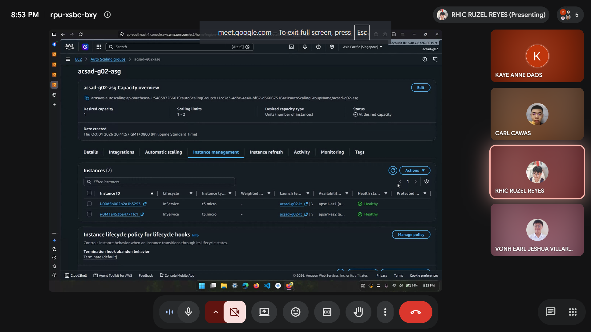
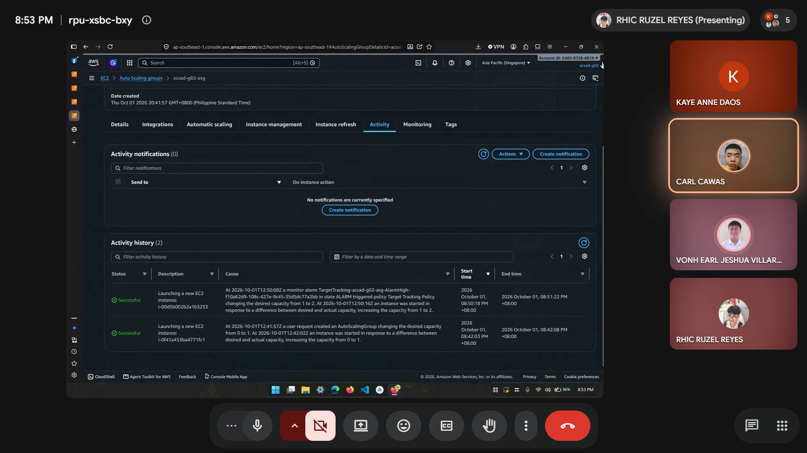
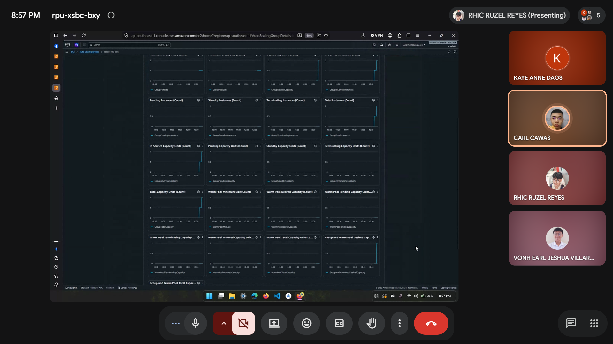

# Lab 2 Submission

## Instance Tracking
**First Instance**
- Instance ID: i-0f41a453ba4771fc1
- Availability Zone: ap-southeast-1a

**Second Instance**
- Instance ID: i-00d5b002b2a1b3253
- Availability Zone: ap-southeast-1b

## Proof (Screenshots)
1. **Activity History:** Add a screenshot showing the Auto Scaling group's Activity history when the second instance launched.
   
   

2. **CloudWatch Alarm:** Add a screenshot of the target tracking alarm in the "In alarm" state.

   

## Questions
1. Why did the group stop at 2 instances?
      The Auto Scaling Group's maximum capacity was likely set to 2 during configuration. Target tracking policies will continue to add instances as long as the alarm threshold is breached, up to the hard limit defined by the maximum capacity setting.

2. Why did terminating an instance by hand not remove the cost?
      When we manually deleted/terminated an instance, the active instance count dropped below the target desired capacity. The Auto Scaling Group's health check detected the missing/unhealthy node and automatically triggered a replacement launch to restore the group to the desired state. Because a new t3.micro was launched immediately in its place, compute resources continued running, resulting in ongoing EC2 hourly and storage charges.

3. Why is the target value set to your assigned value (e.g., 30-85 percent) instead of 99 percent?
      Scaling out is not instantaneous. As shown in the lab's timeline, it takes 1 to 3 minutes for the CPU to cross the threshold, and another 3 to 6 minutes for the new instance to actually launch. If you wait until the CPU hits 99% to trigger the alarm, the existing instance will become unresponsive and drop user requests during the 4+ minutes it takes for the new instance to boot and enter the InService state. Setting a lower target provides a buffer to handle traffic while new servers are provisioning.
   
4. What did the automatic cutoff protect us from?
      It protected you from runaway AWS charges. Because the stress script forces the CPU to 100%, a target tracking policy without a strictly defined maximum capacity (the cutoff) would continuously launch new instances indefinitely in a futile attempt to bring the average CPU utilization down.

5. What changes when a load balancer sits in front of the group?
      When a load balancer sits in front of the auto scaling group, it help in equally distributing traffic across healthy instances. Incoming request are routed and load-balanced dynamically all the healthy InService instance across different Availability Zones.
